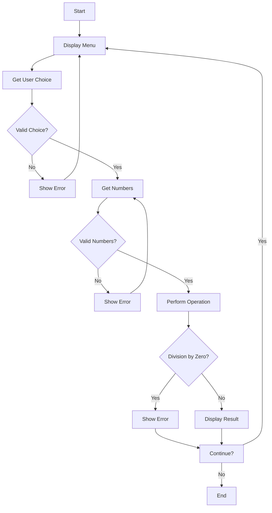

# 🧮 Python Calculator

A comprehensive command-line calculator built in Python that performs basic arithmetic operations along with advanced mathematical functions like GCD and LCM.

## ✨ Features

- **Basic Arithmetic Operations**
  - Addition ➕
  - Subtraction ➖
  - Multiplication ✖️
  - Division ➗
  - Remainder (Modulo) 📊
  - Exponentiation 🔢

- **Advanced Mathematical Functions**
  - Greatest Common Divisor (GCD/HCF) 🔗
  - Least Common Multiple (LCM) 🔢

- **User-Friendly Interface**
  - Interactive menu-driven interface
  - Input validation and error handling
  - Continuous operation until user chooses to exit
  - Clear error messages for invalid inputs

## 🚀 Getting Started

### Prerequisites

- Python 3.10+ (uses `match-case` statements)

### Installation

1. Clone the repository:
```bash
git clone https://github.com/yourusername/python-calculator.git
cd python-calculator
```

2. Run the calculator:
```bash
python calculator.py
```

## 💻 Usage

1. Run the program
2. Choose an operation from the menu (1-8)
3. Enter two numbers when prompted
4. View the result
5. Choose whether to continue or exit

### Example Usage

```
1. Addition
2. Subtraction
3. Multiplication
4. Division
5. Remainder
6. Exponent
7. HCF
8. LCM
Enter operation to perform (1-8): 1
Enter first number: 15
Enter second number: 25
Result: 40
Do you wish to continue? (enter 'no' or 'n'): yes
```

## 🔧 Functions Overview

| Function | Description | Example |
|----------|-------------|---------|
| `addition(a, b)` | Returns sum of two numbers | `addition(5, 3)` → `8` |
| `subtraction(a, b)` | Returns difference of two numbers | `subtraction(5, 3)` → `2` |
| `multiplication(a, b)` | Returns product of two numbers | `multiplication(5, 3)` → `15` |
| `division(a, b)` | Returns quotient of two numbers | `division(6, 3)` → `2.0` |
| `remainder(a, b)` | Returns remainder of division | `remainder(7, 3)` → `1` |
| `exponent(a, b)` | Returns a raised to power b | `exponent(2, 3)` → `8` |
| `gcd(a, b)` | Returns greatest common divisor | `gcd(12, 8)` → `4` |
| `lcm(a, b)` | Returns least common multiple | `lcm(12, 8)` → `24` |

## 🛡️ Error Handling

The calculator includes robust error handling for:

- **Invalid menu selections**: Only accepts numbers 1-8
- **Non-numeric inputs**: Prompts user to enter valid numbers
- **Division by zero**: Prevents division and modulo operations by zero
- **Input validation**: Ensures all inputs are properly formatted

## 🔄 Program Flow



## 🤝 Contributing

Contributions are welcome! Here are some ways you can contribute:

1. **Fork the repository**
2. **Create a feature branch** (`git checkout -b feature/AmazingFeature`)
3. **Commit your changes** (`git commit -m 'Add some AmazingFeature'`)
4. **Push to the branch** (`git push origin feature/AmazingFeature`)
5. **Open a Pull Request**

### Ideas for Contributions

- Add trigonometric functions (sin, cos, tan)
- Implement scientific notation support
- Add memory functions (store/recall)
- Create a GUI version using tkinter
- Add support for complex numbers
- Implement equation solving capabilities

## 📝 License

This project is licensed under the MIT License - see the [LICENSE](LICENSE) file for details.

## 🐛 Known Issues

- None currently reported

## 📞 Support

If you encounter any issues or have questions:

1. Check existing [Issues](https://github.com/yourusername/python-calculator/issues)
2. Create a new issue with detailed description
3. Include your Python version and operating system

## 🎯 Future Enhancements

- [ ] Add graphical user interface
- [ ] Implement calculation history
- [ ] Add unit conversion features
- [ ] Support for matrix operations
- [ ] Integration with symbolic math libraries

---

**Made with ❤️ in Python**

*Happy calculating! 🎉*
